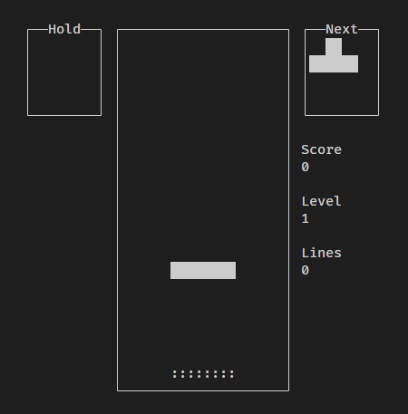

# term-tetris

A Tetris game written in C using `ncurses`.

This is a side project to learn / experiment with the C language.



## Installation

### Manual

Install dependencies

```bash
sudo apt install libncursesw5-dev
```

Compile and run

```bash
make all && ./tetris
```

### Docker

You can the game with the local [Dockerfile](./Dockerfile)

```bash
docker build -t tetris . && docker run -it --rm tetris
```

## Commands

| Key         | Effect     |
| ----------- | ---------- |
| left arrow  | move left  |
| right arrow | move right |
| up arrow    | rotate     |
| down arrow  | soft drop  |
| space       | hard drop  |
| c           | hold       |


## Features

From the [Tetris Guidelines](https://tetris.wiki/Tetris_Guideline)

<!--
More Tetris guidelines docs:

https://www.colinfahey.com/tetris/tetris.html
https://raw.githubusercontent.com/frankkopp/Tetris/master/2009%20Tetris%20Design%20Guideline.pdf
-->

- [X] [Random Generator](https://tetris.wiki/Random_Generator) for sequence of tetrominos
- [X] [Marathon](https://tetris.wiki/Marathon) speed curve
- [X] Scoring
- [X] Next piece display
- [X] [Ghost piece](https://tetris.wiki/Ghost_piece)
- [X] [Hold](https://tetris.wiki/Tetris_Guideline) current piece
- [X] Hard Drop
- [ ] [Lock Delay](https://tetris.wiki/Lock_delay)
- [ ] [Super rotation system](https://tetris.wiki/Super_Rotation_System)
- [ ] Game Over
